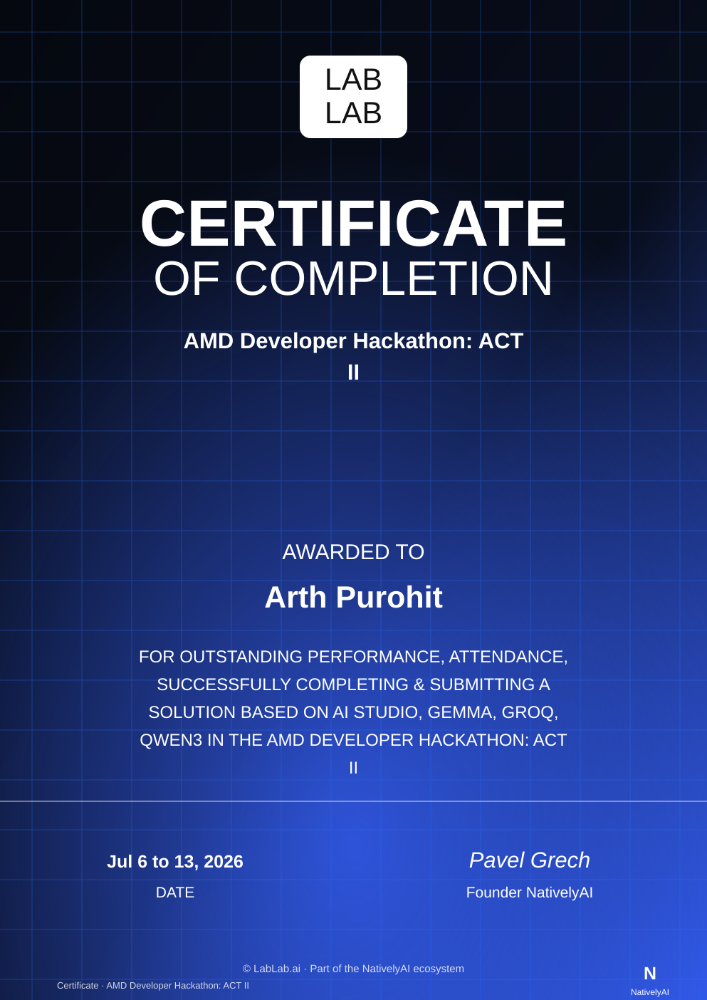

  

  

---

## 🚀 About Me

**Arth (Narco)** — full-stack developer and product builder from India, currently at **Engineering College Bikaner (ECB)**.

I started with Discord communities, Minecraft ecosystems and automation, then moved into full-stack products, SaaS systems, cloud infrastructure and AI-powered applications. I enjoy working across the stack — from interfaces and APIs to data, deployment and the systems connecting everything together.

Through **KryinLabs**, I'm building software around practical AI and developer workflows. My current focus is **Kryin Office**, where I'm working with model integrations, LangGraph and AI-powered automation.

> **Build it. Understand it. Ship it. Improve it.**

## ⚡ Currently Building

**Kryin Office** — an AI workspace focused on connecting models, workflows and automation into one practical environment.

`LangGraph` `AI APIs` `TypeScript` `React` `Supabase`

*Private · Active development*

## 🧠 Knowledge & Tools

*Click a technology to visit its official website or documentation.*

### Languages & Core

### Frontend

### Backend · Data · Cloud

### AI · Automation · Workflow Engineering

### Systems · Tools · Infrastructure

## 🚀 Selected Projects

<strong>01 · Kryin Office</strong> — AI Workspace

 

An AI workspace focused on connecting models, workflows and automation into one practical environment.

`LangGraph` `AI APIs` `TypeScript` `React` `Supabase`

**Private · Active development**

<strong>02 · Edunex</strong> — Education Infrastructure

 

A school-focused platform for administration, academic workflows, attendance and everyday management.

`Full-stack` `Education` `Attendance` `Administration`

<a href="https://github.com/ArthOfficial/edunex"><strong>↗ View Repository</strong></a>

<strong>03 · Parental Monitoring</strong> — Digital Safety

 

A device-management project exploring activity visibility, controls, alerts, startup behavior and remote connectivity.

`JavaScript` `Firebase` `Node.js` `Automation`

<a href="https://github.com/ArthOfficial/Parental-Monitoring"><strong>↗ View Repository</strong></a>

<strong>04 · Advanced Attendance System</strong> — Campus Management

 

An attendance and campus-management system focused on practical administration, workflows and reporting.

`Attendance` `Management` `Automation` `Reporting`

<a href="https://github.com/ArthOfficial/Advanced-Attendance-System"><strong>↗ View Repository</strong></a>

<strong>05 · Kryin Ephor</strong> — Product / SaaS Work

 

A KryinLabs project around product development, SaaS systems and digital workflows.

<a href="https://github.com/ArthOfficial/KryinEphor"><strong>↗ View Repository</strong></a>

<strong>06 · Minecraft & Discord Ecosystems</strong> — Communities / Automation

 

Discord bots, community automation, Minecraft server ecosystems, web panels, role systems and integrations.

`Discord.js` `Node.js` `MongoDB` `APIs` `Automation`

## 🏅 Certificates & Credentials

<strong>01 · AMD Developer Hackathon — ACT II</strong>

 

  

**Issuer:** LabLab · NativelyAI  
**Event:** AMD Developer Hackathon: ACT II  
**Dates:** Jul 6 – 13, 2026  
**Credential ID:** `CMSR98A9V02E1S601DDRU0DQC`

> More verified certificates and credentials will be added here as they are completed.

## 🧭 Currently Exploring

`C++` · `Python` · `Networking` · `AI/ML` · `LangGraph` · `AI Agents` · `Systems` · `Cloud`

I'm especially interested in the layer where **software engineering meets intelligent systems** — applications where AI is part of the workflow rather than simply another feature in the interface.

## 🌐 Find Me

  <a href="https://github.com/ArthOfficial"><strong>◉ GitHub</strong></a>
  &nbsp;&nbsp;&nbsp;&nbsp;&nbsp;&nbsp;&nbsp;&nbsp;&nbsp;&nbsp;
  <a href="https://arth-hub.vercel.app/"><strong>◈ Portfolio</strong></a>
  &nbsp;&nbsp;&nbsp;&nbsp;&nbsp;&nbsp;&nbsp;&nbsp;&nbsp;&nbsp;
  <a href="mailto:purohitarthbkn@gmail.com"><strong>✉ Email</strong></a>

Built, shipped and continuously improved from India.

