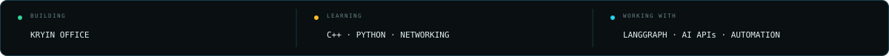
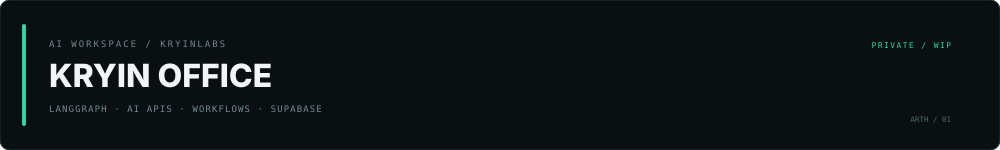
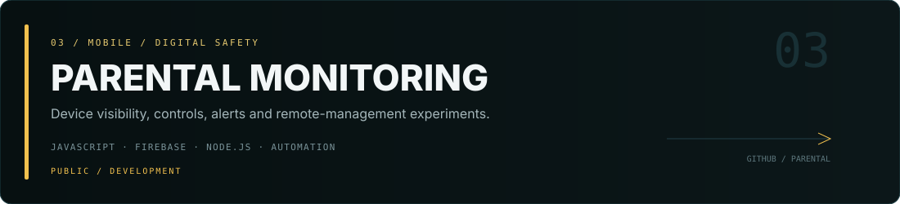
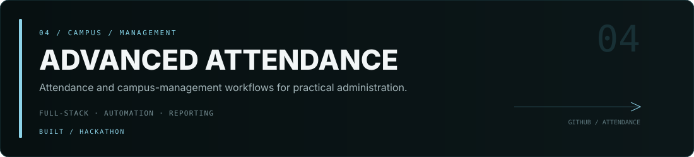

  

  
  
  
  

Engineering College Bikaner (ECB) · India

## About

I'm **Arth**, a full-stack developer and builder from India.

I started by experimenting with Discord communities, Minecraft ecosystems and automation. That gradually turned into building full-stack applications, SaaS-style products, AI integrations and systems that connect the frontend, backend, data and deployment layers together.

I enjoy figuring out how things work end-to-end — then turning that understanding into something useful.

> **I don't wait until I'm ready. I learn by shipping.**

Currently studying at **Engineering College Bikaner (ECB)** while continuing to build, experiment and sharpen my engineering fundamentals.

---

## 🧠 Knowledge

### Languages & Core

  

### Frontend

  

### Backend, Data & Cloud

  

### Tools & Systems

  

`REST APIs` · `Authentication` · `API Integration` · `Discord.js` · `Automation` · `Networking`

### AI / ML & Workflow Engineering

`LangGraph` · `LLM APIs` · `AI/ML` · `AI workflow integration` · `Agent workflows` · `Prompt engineering` · `Python automation`

> **Currently going deeper into:** C++ · Python · Networking · AI/ML · LangGraph

---

## ⚡ Currently Building

**Kryin Office** — an AI workspace focused on bringing models, AI workflows and useful automation into one practical developer/productivity environment.

Working with **LangGraph, AI APIs, TypeScript, React and Supabase**.

The repository is currently private while development continues.

---

## 🚀 Selected Projects

<b>01 · Kryin Office</b> — AI Workspace

 

A lightweight AI workspace exploring practical model integrations, workflow orchestration and agent-style automation.

**Stack / concepts**

`LangGraph` `AI APIs` `TypeScript` `React` `Supabase` `AI workflows`

**Status:** Private · Active development

<b>02 · Edunex</b> — Education Infrastructure

 

A school-focused platform built around administration, academic workflows, attendance and everyday management.

**Stack / concepts**

`Full-stack` `Education workflows` `Attendance` `Administration`

  

<b>03 · Parental Monitoring</b> — Digital Safety

 

A monitoring and device-management project exploring activity visibility, controls, alerts, startup behavior and remote connectivity.

**Stack / concepts**

`JavaScript` `Firebase` `Node.js` `VBS` `Tunneling` `Automation`

  

<b>04 · Advanced Attendance System</b> — Campus Management

 

An advanced attendance and campus-management project focused on practical administration, attendance workflows and reporting.

**Focus**

`Attendance` `Management` `Automation` `Reporting` `Full-stack`

  

<b>05 · Kryin Ephor</b> — Product / SaaS Work

 

A KryinLabs project and part of my broader work around building software products and SaaS systems.

  

<b>06 · Minecraft & Discord Ecosystems</b> — Communities / Automation

 

One of the foundations of my development journey: Discord bots, community automation, Minecraft server ecosystems, web panels, role systems and integrations.

`Discord.js` `Node.js` `MongoDB` `APIs` `Automation`

---

## 🤖 How I Work With AI

AI is part of my engineering toolkit — not a substitute for understanding what I'm building.

I use it for things such as:

- exploring unfamiliar libraries, APIs and documentation
- testing architecture ideas and implementation approaches
- debugging and reviewing code
- building AI-powered product features
- connecting LLMs to real application workflows
- designing graph-based workflows with **LangGraph**
- automating repetitive development tasks
- rapidly testing ideas before validating the actual implementation

The goal is simple: **understand it, verify it, modify it and be able to maintain it.**

---

## 📊 GitHub Activity

  
  

---

## 🧭 What I'm Exploring

`C++` · `Python` · `Networking` · `AI/ML` · `LangGraph` · `AI agents` · `Systems` · `Cloud`

I'm especially interested in the layer where **software engineering meets intelligent systems** — applications where AI is actually part of the workflow rather than just a feature pasted onto the interface.

---

## 🌐 Find Me

  
  
  

Built, shipped and continuously improved from India.

